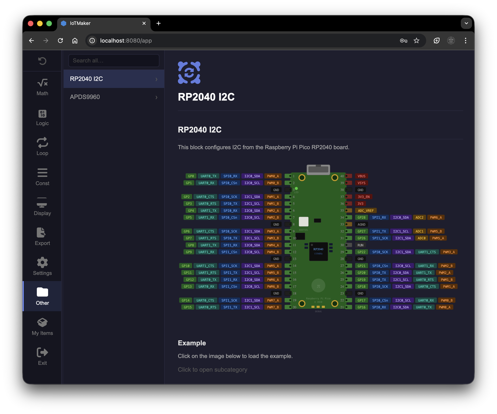
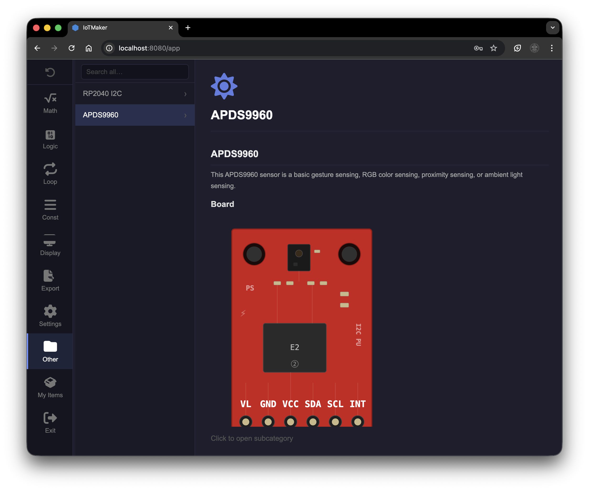
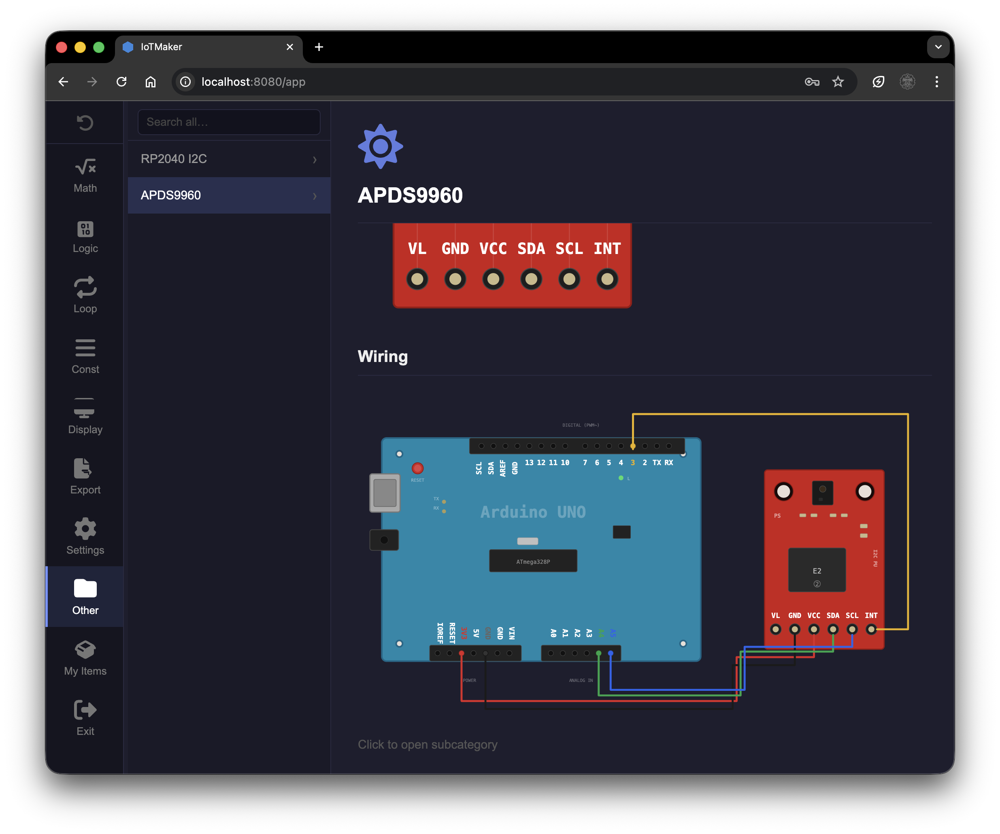
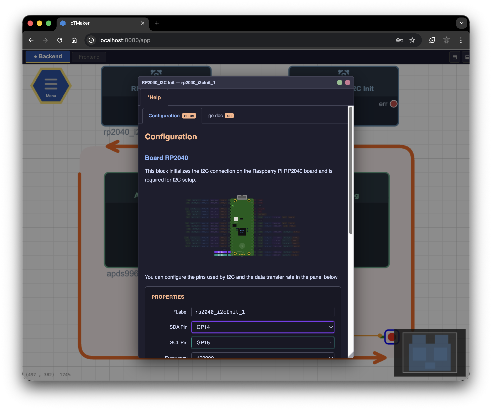
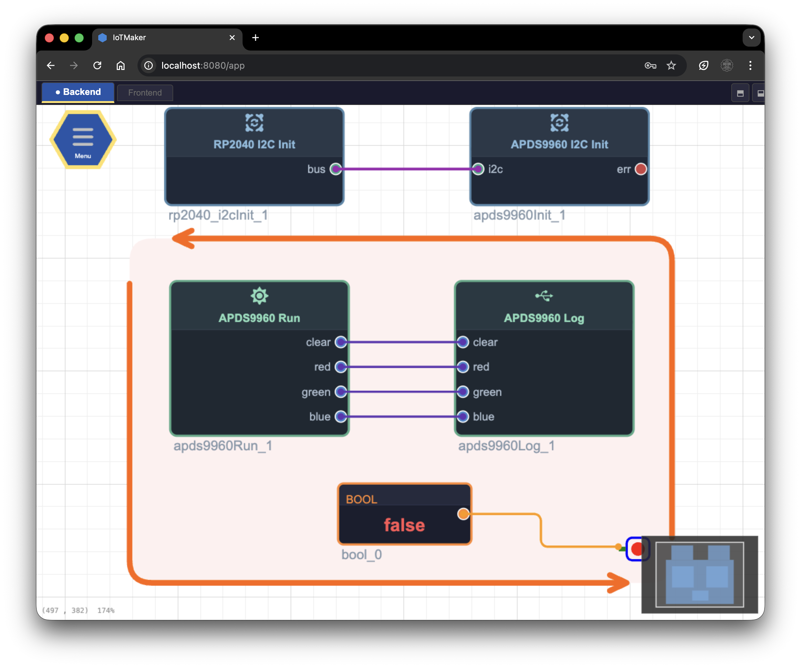

# IoTMaker

## ❤️ Support this project

IoTMaker is built by a single developer. If you believe a kid in a classroom
and an engineer in a lab should be able to use the same tool, you can help:

[](https://github.com/sponsors/helmutkemper)
[](https://ko-fi.com/helmutkemper)

> **Status:** under active development. Go code generation and C99
> target support are in progress.












[](./LICENSE)
[](./LICENSING.md)

**A visual IDE for firmware. What Arduino did for hardware, IoTMaker aims to do
for the code.**

IoTMaker is a graphical Go/WASM IDE that blends visual and textual programming.
You build logic by connecting blocks on a stage, and the IDE generates
compilable source code. It is inspired by LabVIEW and Arduino: the same block a
child wires visually is a block an engineer can write in Go.

## Who it's for

- **Makers** connect blocks on the stage and export working code — no
  programming required.
- **Specialists** write reusable components ("black boxes") in Go, following the
  IoTMaker Doc Standard; each one becomes a graphical block a maker can wire.

## How it works

A project has two stages: a **backend stage** for logic and data (blocks and
wires), and a **frontend stage** for the live dashboard. The canvas is the
single source of truth — on export, the scene is compiled through an
intermediate representation into the target language, so adding a new target is
writing a new backend rather than a rewrite.

## Start server

```bash
  cd server
  make docker-up-full
```

## Documentation

The documentation is preliminary and is located in the [00_howto](00_howto/01_device) folder.

## License

IoTMaker uses a **two-level** licensing model — please read this before building
on it.

### The IoTMaker platform (this repository)

The IDE, generator, and libraries are **dual-licensed**:

- **Open source — GNU AGPL v3.0** — see [`LICENSE`](./LICENSE). If you run a
  modified version as a network service, you must make your source available.
  This is what keeps IoTMaker open and prevents it from being closed and resold
  as a service.
- **Commercial** — for embedding IoTMaker in a proprietary product or a hosted
  service without AGPL obligations — see [`LICENSING.md`](./LICENSING.md).
  Contact **licensing@iotmaker.io**.

### Code you create with IoTMaker is yours

Firmware generated by the tool, and components you export, are **not** covered by
the AGPL. You own your output and may license it however you choose. Exported
projects default to the **Apache License 2.0**. See the
[generated-code exception](./GENERATED-CODE-EXCEPTION.md).

### Contributing

Contributions are made under the [Contributor License Agreement](./CLA.md); see
[`CONTRIBUTING.md`](./CONTRIBUTING.md).

## Trademark

"IoTMaker", the IoTMaker logo, and iotmaker.io are reserved and are **not**
licensed under the AGPL. You may run and fork the code, but you may not present a
fork as the official IoTMaker project or use the name or logo to imply
endorsement.

## Links

- Website: https://iotmaker.io
- Licensing overview: [`LICENSING.md`](./LICENSING.md)
- How to contribute: [`CONTRIBUTING.md`](./CONTRIBUTING.md)
