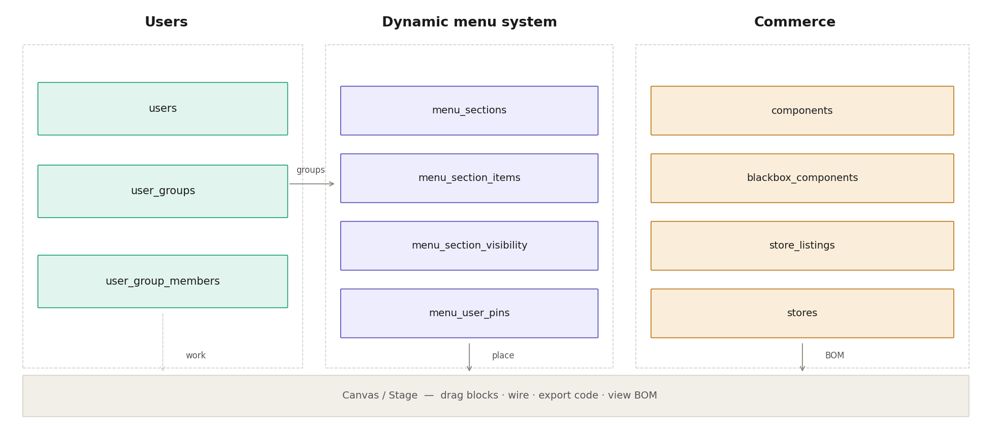
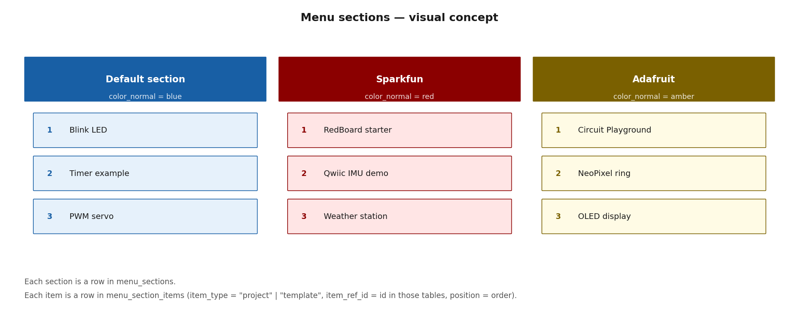
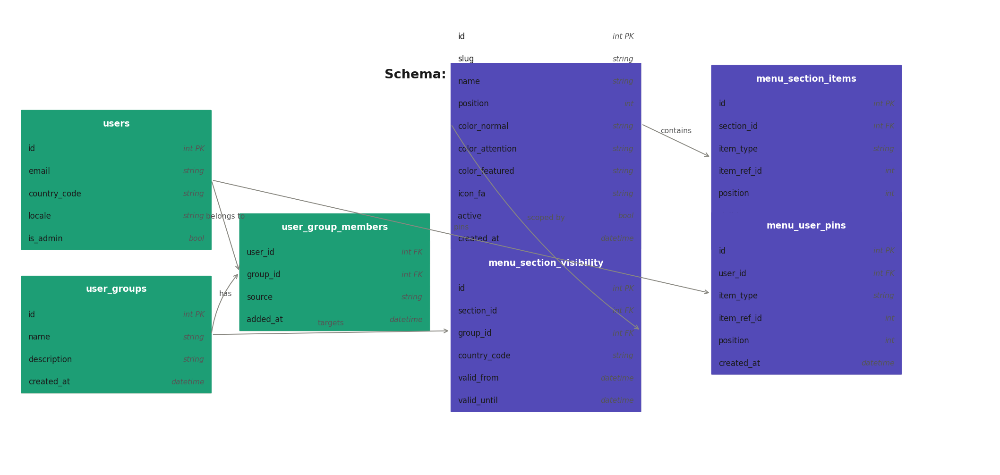
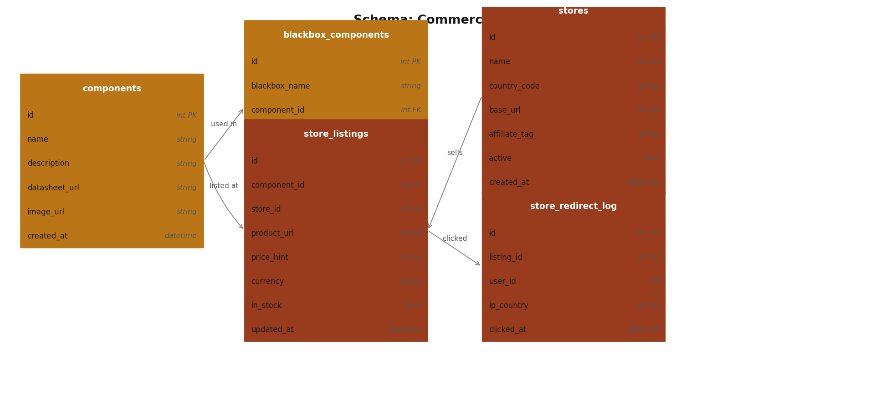
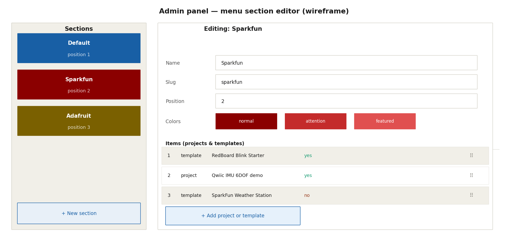
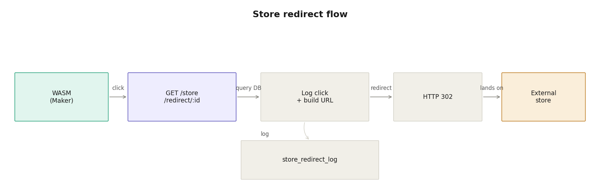

# IoTMaker — Menu sections, groups & store architecture

> Revised design document — supersedes the previous version.
> Keep this file alongside `CLAUDE.md` as the reference for implementing
> the dynamic menu system, user groups, and commerce/BOM features.

---

## What changed from the first draft

The first draft proposed using `menu_promotions` to highlight existing
hardcoded Go menu items. That was wrong.

**Hardcoded Go items** (`SysMath`, `SysLogic`, `SysLoop`, `Add`, `Sub`, …)
are programming primitives — `if`, `else`, `switch`, math operators. They
are not subject to promotion because they have no brand, no store, and no
dynamic content. They stay exactly as they are in the Go code.

**What is dynamic** is everything that does not require a recompile:
projects and templates published by admin users. These form **named sections**
with their own visual identity — Sparkfun in red, Adafruit in amber, the
platform default in blue. The admin places projects and templates into sections,
sets their order, and controls visibility by user group and country — all from
a web panel, with no deployment.

---

## Platform overview



The canvas (stage) is the center. Every other system feeds into it or reads from it:

- **Users** build projects, accumulate group memberships, and pin items to their personal menu
- **Dynamic menu system** drives which branded sections appear and in what order
- **Commerce** is triggered by canvas contents (which black-box chips are in use)

---

## The menu section concept



A **section** is a named, color-coded group that appears as a submenu in the
IDE main menu. The admin creates sections freely — the Go code does not need
to know their names in advance.

Each section has:

| Field | Purpose |
|---|---|
| `name` | Display name shown in the menu (`"Sparkfun"`, `"Adafruit"`) |
| `slug` | URL-safe identifier used as `MenuItem.ID` in the WASM (`"sparkfun"`) |
| `position` | Order in the menu (lower = higher) |
| `color_normal` | Dominant color for the hexagon in normal state |
| `color_attention` | Color when flashing (attention state) |
| `color_featured` | Color when statically highlighted (selected state) |
| `icon_fa` | FontAwesome icon name for the section hexagon |
| `active` | Soft switch to hide a section without deleting it |

Each section contains **items** — rows in `menu_section_items`:

| Field | Purpose |
|---|---|
| `item_type` | `"project"` or `"template"` |
| `item_ref_id` | ID in the `projects` or `templates` table |
| `position` | Order within the section |
| `visible` | Per-item soft switch |

The WASM fetches sections and their items from the API at startup, exactly
the same way it fetches black-box definitions. `MenuBuilder.SetSections()`
receives the list and `Build()` generates `MenuItem` entries with the
section's colors applied to their `Styles` array.

---

## What happens in `MenuBuilder.Build()`

```
hardcoded Go items       → always present, fixed order, unchanged
─────────────────────────────────────────────────────────────────
dynamic sections (DB)    → appended after hardcoded items
  each section           → one ItemSubmenu entry, colors from DB
    each section item    → one ItemAction entry inside the submenu
      OnClick            → factory.CreateBlackBoxInit / CreateBlackBoxMethod
                            depending on item_type resolution
```

The section's `color_normal` / `color_attention` / `color_featured` map
directly to `IconStyle` in `hexMenu.MenuItem.Styles`, using the existing
`PipelineState` infrastructure. No new render code is needed.

---

## Schema — Users & menu sections



### Key decisions

| Table | Decision |
|---|---|
| `users.is_admin` | Admin users are the only ones who can publish items that appear in sections. |
| `user_groups` | Plain rows. No hard-coded types. `source = "admin"` or `"auto"` (usage-detected). |
| `menu_sections` | One row per branded section. The slug becomes `MenuItem.ID` in the WASM. |
| `menu_section_visibility` | Nullable `group_id` and `country_code` — `NULL` means all groups / all countries. `valid_from` / `valid_until` allow time-limited campaigns (e.g. a section active only during a product launch period). |
| `menu_section_items` | `item_type` ∈ `{"project", "template"}`. `item_ref_id` = primary key in the respective table. `position` = drag-and-drop order in the admin panel. |
| `menu_user_pins` | Maker's personal pins from the feed ("Add to my menu"). Appears as a personal submenu, separate from admin sections. |

### How visibility works at API time

```
GET /api/menu/sections

Server evaluates for the requesting user:
  1. All sections where menu_section_visibility has no row → visible to everyone
  2. Sections with a visibility row matching:
       - user's group_id (any of the user's groups), AND/OR
       - user's country_code, AND
       - NOW between valid_from and valid_until (NULLs treated as open-ended)
  3. Returns only active sections, ordered by position ASC
```

---

## Schema — Commerce & BOM



### Key decisions

| Table | Decision |
|---|---|
| `components` | One row per physical chip or module. Shared across all stores and countries. |
| `blackbox_components.blackbox_name` | The Go struct name (e.g. `"APDS9960"`). The maker buys the chip once regardless of how many methods they place. |
| `stores` | One row per external store per country. `base_url` + `affiliate_tag` live here. |
| `store_listings` | Joins a component to a store. `product_url` is relative to `base_url`. `price_hint` is informational — the store is the price authority. |
| `store_redirect_log` | Analytics only. No personal data beyond `user_id`. Enables attribution and affiliate verification. |

### Who creates `blackbox_components`?

The platform administration team. Specialists write code; admins map code to
physical parts. A future workflow could allow specialists to suggest mappings
(pull-request style) with admin approval, but that is out of scope for the
first implementation.

---

## Admin panel — menu section editor



The admin panel is a standard Echo server-rendered HTML page (or a small SPA).
It does not require WASM.

**Left column** — section list with drag-to-reorder. Each section shows its
color as background. The position number updates automatically on drag.

**Right column** — section detail:
- Name, slug, position (editable)
- Three color pickers: `color_normal`, `color_attention`, `color_featured`
- FontAwesome icon picker
- Item list with: position (drag handle), type badge, title, visible toggle
- "Add project or template" opens a search modal over the feed

**Visibility tab** (not shown in wireframe) — adds/removes rows in
`menu_section_visibility`: pick a user group, pick a country, set date range.

---

## Store redirect flow



1. Maker opens the BOM panel (toolbar button, available at any time)
2. WASM reads the scene, collects all `blackbox_name` values in use
3. `GET /api/bom?names=APDS9960,ATtiny85&country=BR` returns components + listings
4. Maker sees a card per component with description and a "Buy" button
5. "Buy" navigates to `GET /store/redirect/:listing_id`
6. Server logs the click, builds `base_url + product_url + ?tag=affiliate_tag`, responds `HTTP 302`
7. Browser lands on the external store — transparent to the maker

**The WASM never receives affiliate URLs.** If an affiliate agreement changes,
only the database row changes. No frontend deployment needed.

---

## Endpoint access control

Three roles exist in the system. The middleware reads `users.is_admin` from
the session token. There is no intermediate "moderator" role for now — that
can be added as a second boolean column when needed.

| Role | Description |
|---|---|
| `anon` | Not authenticated. Can read public feed only. |
| `maker` | Authenticated, `is_admin = false`. Normal IDE user. |
| `admin` | Authenticated, `is_admin = true`. Full control over dynamic content. |

### Public API — no authentication required

| Method | Endpoint | Who | Purpose |
|---|---|---|---|
| `GET` | `/api/menu/sections` | anon, maker, admin | Fetch active sections filtered by user context (groups, country, date). Anonymous users receive only sections with no visibility restriction. |
| `GET` | `/api/bom` | anon, maker, admin | Fetch component + store listing data for a list of black-box names. Query param `?names=APDS9960,ATtiny85&country=BR`. |
| `GET` | `/store/redirect/:listing_id` | anon, maker, admin | Log click and redirect to external store. Anonymous clicks are logged with `user_id = NULL`. |

### Maker API — authentication required (`is_admin = false` or `true`)

| Method | Endpoint | Who | Purpose |
|---|---|---|---|
| `GET` | `/api/user/pins` | maker, admin | List the requesting user's personal menu pins. |
| `POST` | `/api/user/pins` | maker, admin | Add a project or template to personal menu pins. Body: `{item_type, item_ref_id}`. |
| `DELETE` | `/api/user/pins/:id` | maker, admin | Remove a personal pin. Only the owner can delete their own pin. |
| `PATCH` | `/api/user/pins/:id/position` | maker, admin | Reorder personal pins. Body: `{position}`. |

### Admin API — `is_admin = true` required

All `/admin/*` routes return `403 Forbidden` if `is_admin = false`.

#### Menu sections

| Method | Endpoint | Purpose |
|---|---|---|
| `GET` | `/admin/sections` | List all sections ordered by position. |
| `POST` | `/admin/sections` | Create a new section. Body: `{name, slug, position, color_normal, color_attention, color_featured, icon_fa}`. |
| `GET` | `/admin/sections/:id` | Get one section with its items and visibility rules. |
| `PUT` | `/admin/sections/:id` | Replace a section's fields (name, slug, colors, icon, active, position). |
| `DELETE` | `/admin/sections/:id` | Delete a section and cascade-delete its items and visibility rows. |
| `PATCH` | `/admin/sections/:id/position` | Reorder sections. Body: `{position}`. Updates other sections' positions to fill the gap. |

#### Section items

| Method | Endpoint | Purpose |
|---|---|---|
| `GET` | `/admin/sections/:id/items` | List items in a section ordered by position. |
| `POST` | `/admin/sections/:id/items` | Add a project or template to a section. Body: `{item_type, item_ref_id, position}`. |
| `PATCH` | `/admin/sections/:id/items/:item_id` | Update `position` or `visible` for one item. |
| `DELETE` | `/admin/sections/:id/items/:item_id` | Remove an item from a section. |

#### Section visibility

| Method | Endpoint | Purpose |
|---|---|---|
| `GET` | `/admin/sections/:id/visibility` | List visibility rules for a section. |
| `POST` | `/admin/sections/:id/visibility` | Add a rule. Body: `{group_id, country_code, valid_from, valid_until}`. All fields nullable — omit to mean "all". |
| `DELETE` | `/admin/sections/:id/visibility/:rule_id` | Remove a visibility rule. |

#### User groups

| Method | Endpoint | Purpose |
|---|---|---|
| `GET` | `/admin/groups` | List all groups. |
| `POST` | `/admin/groups` | Create a group. Body: `{name, description}`. |
| `PUT` | `/admin/groups/:id` | Update group name/description. |
| `DELETE` | `/admin/groups/:id` | Delete a group and its memberships. |
| `GET` | `/admin/groups/:id/members` | List members with source and date. |
| `POST` | `/admin/groups/:id/members` | Add a user manually. Body: `{user_id}`. Sets `source = "admin"`. |
| `DELETE` | `/admin/groups/:id/members/:user_id` | Remove a user from a group. |

#### Commerce

| Method | Endpoint | Purpose |
|---|---|---|
| `GET` | `/admin/components` | List all components. |
| `POST` | `/admin/components` | Create a component. Body: `{name, description, datasheet_url, image_url}`. |
| `PUT` | `/admin/components/:id` | Update a component. |
| `DELETE` | `/admin/components/:id` | Delete a component (only if no active store listings reference it). |
| `GET` | `/admin/components/:id/blackboxes` | List black-box associations for a component. |
| `POST` | `/admin/components/:id/blackboxes` | Associate a black-box struct name. Body: `{blackbox_name, quantity, notes}`. |
| `DELETE` | `/admin/components/:id/blackboxes/:bb_id` | Remove an association. |
| `GET` | `/admin/stores` | List all stores. |
| `POST` | `/admin/stores` | Create a store. Body: `{name, country_code, base_url, affiliate_tag, active}`. |
| `PUT` | `/admin/stores/:id` | Update a store (e.g. rotate affiliate tag). |
| `GET` | `/admin/stores/:id/listings` | List all listings for a store. |
| `POST` | `/admin/stores/:id/listings` | Add a listing. Body: `{component_id, product_url, price_hint, currency, in_stock}`. |
| `PATCH` | `/admin/stores/:id/listings/:listing_id` | Update price hint, stock status, or product URL. |
| `DELETE` | `/admin/stores/:id/listings/:listing_id` | Remove a listing. |
| `GET` | `/admin/redirect-log` | Analytics: list redirect clicks. Supports `?listing_id=`, `?country=`, `?from=`, `?until=`. |

### Middleware stack for `/admin/*`

```
Request
  → AuthMiddleware          (validates session token, loads user into context)
  → AdminOnlyMiddleware     (checks is_admin = true, returns 403 if false)
  → handler
```

Both middlewares live in `server/middleware/`. `AdminOnlyMiddleware` is a
one-liner that reads the user from context and aborts if not admin. This
keeps the handler code free of auth checks.

## Files to create

```
server/
  middleware/
    auth.go                 — AuthMiddleware: validates session, loads user into context
    admin_only.go           — AdminOnlyMiddleware: 403 if is_admin = false

  handler/
    menu_sections.go        — GET /api/menu/sections
    bom.go                  — GET /api/bom
    store_redirect.go       — GET /store/redirect/:listing_id
    user_pins.go            — GET/POST/DELETE/PATCH /api/user/pins
    admin_sections.go       — CRUD /admin/sections + items + visibility
    admin_groups.go         — CRUD /admin/groups + members
    admin_components.go     — CRUD /admin/components + blackboxes
    admin_stores.go         — CRUD /admin/stores + listings
    admin_redirect_log.go   — GET /admin/redirect-log

  store/
    menu_sections.go        — DB: sections, section_items, section_visibility, user_pins
    components.go           — DB: components, blackbox_components
    stores.go               — DB: stores, store_listings, store_redirect_log

  migration/
    004_menu_sections.sql
    005_commerce_bom.sql

ui/mainMenu/
  sections.go               — MenuSection type + SetSections() on MenuBuilder
                              converts DB color strings to hexMenu.IconStyle arrays

admin/                      — Echo group mounted at /admin (admin_only middleware applied)
  handler/
    sections.go
    groups.go
    components.go
    stores.go
  template/
    layout.html
    sections_list.html
    section_edit.html
    groups_list.html
    group_edit.html
    components_list.html
    component_edit.html
    stores_list.html
    store_edit.html
    redirect_log.html
```

---

## What is NOT in scope for the first implementation

- Checkout, payment, or cart — the store handles that externally
- Affiliate revenue tracking beyond the redirect log
- Specialist-submitted `blackbox_components` suggestions
- BOM export to CSV/PDF
- Maker-facing "my pins" UI (the DB table exists; the UI is a future task)
- Real-time section reloading in the WASM — sections are fetched once at startup
