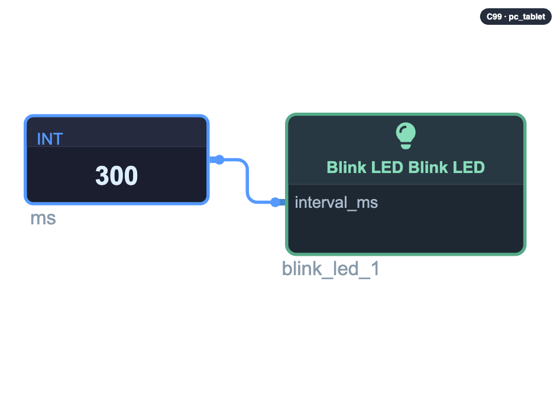

# Blink LED

Your first device: it prints ` + "`LED ON` / `LED OFF`" + ` forever, at the
rhythm you choose.

**How to use it on the stage**

1. Drag **Blink LED** onto the stage.
2. Drag a **Const · Int** and type the interval in milliseconds
   (try ` + "`500`" + `).
3. Wire the Const into the **interval_ms** pin.
4. Run — and change the number to feel the rhythm change.

That is the whole loop of IoTMaker: wire, run, tweak.
